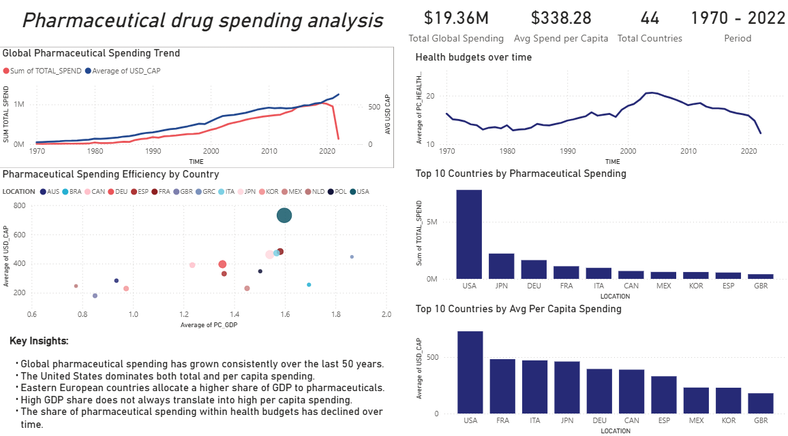

# Pharmaceutical Drug Spending Analysis

## Project Overview
Exploratory analysis of global pharmaceutical drug spending using SQL (MySQL) 
and Power BI to identify country rankings, long-term spending trends, GDP and 
health budget prioritization across OECD countries.

---

## Dataset
- **Source:** [Pharmaceutical Drug Spending by Countries - OECD](https://datahub.io/core/pharmaceutical-drug-spending)
- **Records:** 1,341 rows — 44 countries, period 1970–2022
- **Fields:** location, time, pc_health, pc_gdp, usd_cap, total_spend

---

## Tools
- **MySQL** — data analysis and querying
- **Power BI** — dashboard and data visualization

---

## File Structure
```
pharma_drug_spending_analysis.sql
│
├── 1. OVERVIEW
├── 2. SPENDING TRENDS OVER TIME
├── 3. COUNTRY COMPARISONS
└── 4. HEALTH BUDGET ANALYSIS
```

---

## Key Findings

### 1. Overview
- The dataset covers **44 countries** across a **52-year period** (1970–2022)
- **USA** leads in both total spending and per capita expenditure ($730 avg USD/capita)
- **Eastern European countries** (Bulgaria, Hungary, Slovakia) allocate the largest 
  share of their GDP and health budgets to pharmaceuticals, despite lower absolute 
  spending levels
- Smaller economies like **Malta and Switzerland** rank above larger ones in per 
  capita spending, suggesting high-cost pharmaceutical markets

### 2. Spending Trends Over Time
- Global pharmaceutical spending grew consistently from **$8,492M in 1970** to a 
  peak of **$1,039,235M in 2019**, with a notable decline in 2022 likely due to 
  incomplete data
- **USA** shows the highest absolute growth ($433,963M), nearly **4x Japan's** 
  growth ($107,628M)
- Global spending grew exponentially across decades: from **$152,719M in the 1970s** 
  to **$9,019,498M in the 2010s**, a 59x increase over five decades

### 3. Country Comparisons
- **Bulgaria** allocates 35.28% of its health budget to pharmaceuticals, the highest 
  among all reported countries, followed by Slovakia (29.66%) and Hungary (29.56%)
- All top 10 countries by health budget share are Eastern European, suggesting a 
  **regional structural pattern** in pharmaceutical policy
- **Canada, South Korea and Iceland** provide the most complete historical data 
  (53 years), while countries like Chile (3 years) and Brazil (5 years) have very 
  limited coverage, affecting the reliability of their averages

### 4. Health Budget Analysis
- The global average pharmaceutical share of health budgets **peaked in the 2000s** 
  (~19.47%) and has been declining since, reaching 12.25% in 2022
- **Switzerland** shows the most stable pharmaceutical budget share over time 
  (range of only 0.67%), reflecting consistent long-term policy
- The declining trend is observed in most countries, suggesting a **global 
  rebalancing toward other healthcare services** beyond medication

---

## Business Recommendations
- Investigate the structural causes behind Eastern Europe's heavy reliance on 
  pharmaceuticals relative to their health budgets
- Monitor countries with declining pharmaceutical budget shares to assess whether 
  this reflects improved healthcare efficiency or reduced access
- Use per capita spending alongside GDP share for a more complete picture of 
  pharmaceutical prioritization, as absolute spending alone can be misleading

---

## Dashboard

